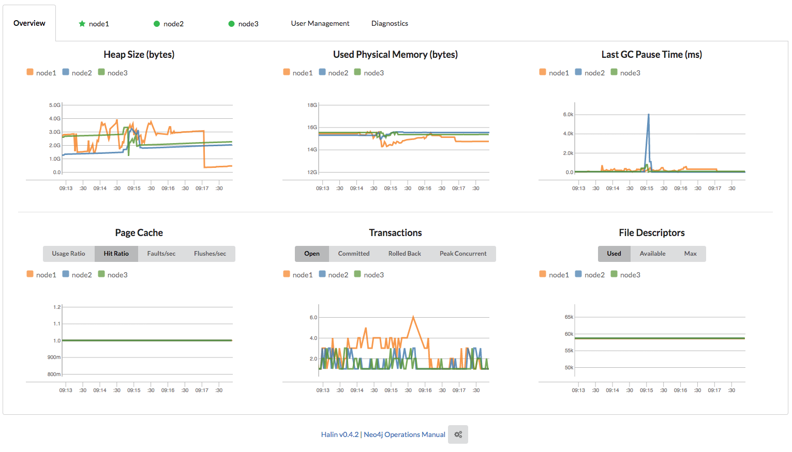
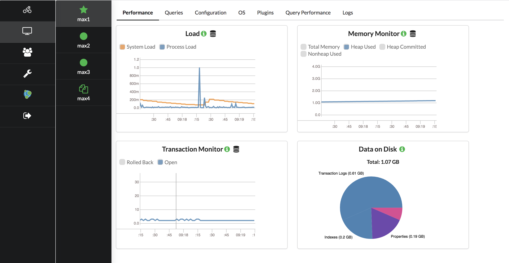
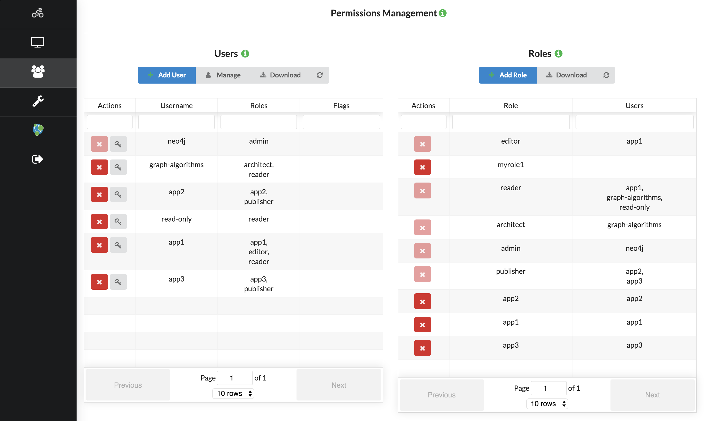
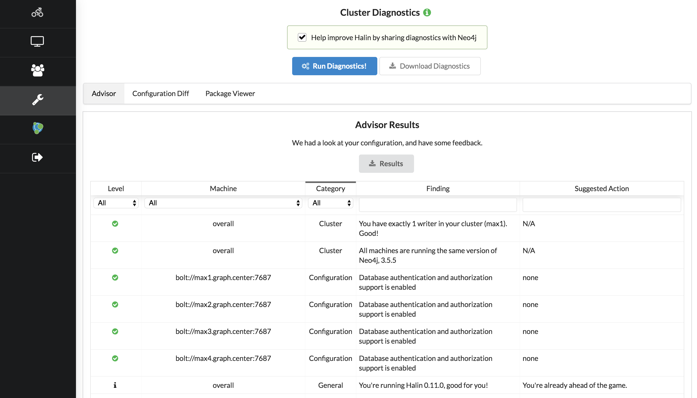

[](https://circleci.com/gh/moxious/halin)

## Halin Neo4j Monitoring

Halin is a Graph App for monitoring Neo4j. 

**[Click here to run Halin!](https://halin.graphapp.io/)**

Primary features:
1. Performance monitoring (system load, memory usage)
2. Checks your Neo4j configuration and finds problems, makes suggestions on how to improve.
3. Works with both Neo4j Enterprise and Neo4j Community, clusters and stand-alone.
4. User & Role Management

### Deploying Halin on Your Own (e.g. behind a company firewall)

1. `yarn install` to pull dependencies
2. Edit package.json locally, and change the "homepage" field to the URL where Halin
will be accessible when deployed.  For example, if you're using an internal company
site `https://fileserver.mycompany.com` you might set this to 
`https://fileserver.mycompany.com/halin`
3. `npm run build` to build the finished HTML/CSS artifacts; this will produce a `dist`
folder containing everything needed to be deployed.
4. Copy everything in the `dist` folder to your file sharing server; in the example above
that would be a `halin` directory hosted by `fileserver.mycompany.com`.

Halin's build chain already does all of these steps; the public version of Halin is hosted
in an AWS S3 bucket.  If you'd like to see a scripted version of how that was done, 
check the `.circleci/config.yml` file, and look for the "Deploy to S3" step.

## Running Halin in Development Mode

1. Clone the repo
2. `yarn install`
3. `yarn start`
4. Navigate to `http://localhost:3000/`

### Running in Docker

```
docker run -d -p 127.0.0.1:3000:3000 --rm -t mdavidallen/halin:latest 
```

Open a browser to http://localhost:3000/

If you'd like to build the Halin docker container from source:

```
docker build -t halin:latest -f Dockerfile .
```

### Running as a GraphApp

4. Inside of Neo4j Desktop, go to application settings, scroll all the way to the bottom, enable development mode
5. For development app entry point, use http://localhost:3000/ (that's where yarn start will serve the app)
6. For development app root path, enter /absolute/path/to/halin where you cloned the repo
7. Finally, inside of desktop you'll see a special tile labeled "Development App 9.9.9".  This will
point to your running copy of Halin

## FAQ

1. Does it support Neo4j Enterprise or Community?

Both.  Some features must be disabled for community (such as user management) because community does not support them.  For a comparison of features between Neo4j Enterprise and Community, [see this link](https://neo4j.com/subscriptions/#editions)

2. Does Halin capture any data about my database?

Halin runs purely in your browser and does not share details of your database outside of
your machine.  Even when you generate a diagnostic package, this is not shared.  Halin 
does use a JS error reporting library called Sentry to help catch errors and improve the
software, but nothing about your configuration is sent back to me.  You may optionally
tick a box in the diagnostics pane to "opt-in" share your diagnostic package, which helps
us improve Halin & Neo4j.

3. What versions of Neo4j does Halin support?

*Supported*:  3.4.* and 3.5.*; causal cluster and stand-alone, enterprise and community.

*Unsupported*: Neo4j < 3.4, embedded deployments, and HA deployments.

4. How does Halin work?

Halin uses pure cypher/bolt connections to nodes in your cluster, and uses Neo4j's existing
management interfaces and queries, including things like JMX, to obtain all statistics.  This approach will work on any Neo4j instance with zero modification or configuration.

If you'd like to see what kinds of queries Halin is running, click on the gear icon at
the very bottom and you'll get a pop-up showing all of the queries and their response
times.

5. Do I have to run Halin as an admin user?

No, but some types of data (for example your configuration) are not available unless you
are an administrator.  If you run halin with a low privileged user, some features may not
be available or work as expected.  An admin user is highly recommended.

6. Why doesn't (this feature) appear in Halin?  Why can't I use User administration?

Depending on how your database is configured, some options are not available.  For example,
active running query monitoring requires procedures that are only available in Neo4j
Enterprise, so if you're running Community this feature will be disabled.  This is not
due to a limitation of Halin, simply which functionality the Neo4j instance exposes.

Additionally, there are some special circumstances. For example if you use an LDAP
authorization provider, Halin will not permit adding users because Neo4j itself is not
the authority on the user set.

7. Why is it called Halin?

The application is named for [Rudolf Halin](https://en.wikipedia.org/wiki/Rudolf_Halin) an
influential German graph theorist, who came up with (among many other things) [Halin graphs](https://en.wikipedia.org/wiki/Halin_graph).

8. How much load does Halin put on my cluster?

Halin polls your Neo4j cluster by sending a variety of queries concurrently to each member of the
cluster.  Generally, these queries are answered very quickly by Neo4j, requiring a few milliseconds
per query.  The total load that Halin will place on the average small database, for example one
running in Neo4j Desktop, will generally be about 1% of its load, with larger clusters experiencing
a small fraction of a percent of the concurrent queries Neo4j can handle, and CPU.  Further, these
queries are strictly read-only (unless you are creating users/roles) and generally require little
heap.   All in all, the load Halin places should be negligible.

## Installing Halin in Neo4j Desktop

**Neo4j Desktop minimum version 1.1.10 is required.**

1. Open Neo4j Desktop
2. Click on the "Graph Applications" tile at left
3. Scroll to the bottom where it says "Install Graph Application"
4. Enter the URL `https://neo.jfrog.io/neo/api/npm/npm/halin` into the box
5. Click install

That's it.  As Neo4j Desktop is installed, and as new versions of Halin are available,
you'll catch updates.

## Screenshots









## Serve in Neo4j Desktop env
To serve it as a graph application, read the docs for that in the Neo4j Desktop development pages.
